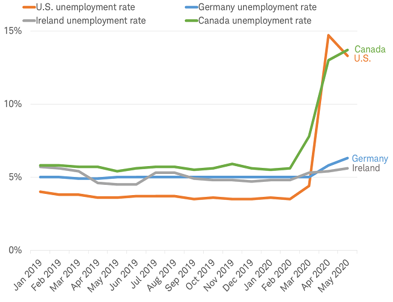
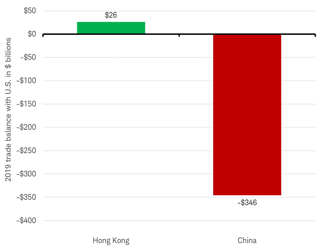
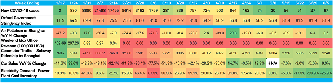
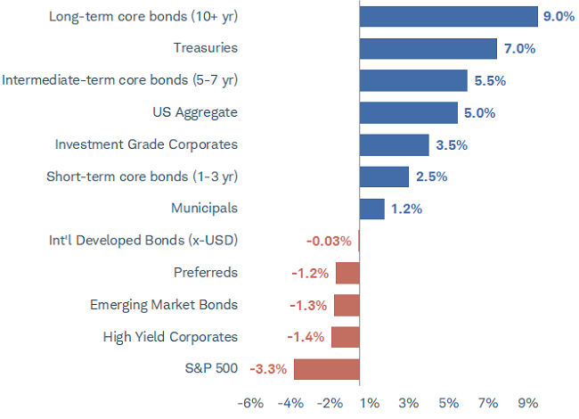

# Schwab Market Perspective Schwab市场前景分析
Many have been confounded by the stock market's surge since March 23rd amid less-than-rosy U.S. economic data. That disconnect narrowed on Thursday, as jitters about a potential second wave of COVID-19 infections, along with a grim economic outlook from the Federal Reserve - drove investors out of riskier assets and led to a 5.9% drop in the S&P 500 index.

由于美国经济数据不太乐观，许多人对3月23日以来股市的飙升感到困惑。周四，由于对可能出现的第二波新冠病毒感染的担忧，以及美联储对经济前景悲观的预期，投资者纷纷撤离风险较高的资产，导致标准普尔500指数下跌5.9%。

Ongoing volatility underscores the precariousness of the recent rally. Even as the S&P 500 index rallied to recoup much of the losses made since its March 23rd low, we have cautioned that a second wave of coronavirus cases could upend investor confidence, raising the prospect of a fresh round of social-distancing restrictions or layoffs.

持续的波动凸显了近期反弹的不稳定性。尽管标普500指数反弹，收复了自3月23日低点以来的大部分损失，但我们担心第二波新冠病毒病例可能会颠覆投资者信心，增加新一轮社会隔离措施和裁员的可能性。

## U.S. stocks and economy: Mixed signals 美国股市和经济：好坏参半
In recent weeks, the gap between economists' estimates and actual May U.S. payroll gains caused Citi's Economic Surpirse Index to spike. The series, which measures data surprises relative to market expectations, has recovered from its deep plunge into negative territory, confirming that data in the pst wek have continued to come in better than anticipated - although remaining very week in absolute terms.

在最近几个礼拜中， 美国五月份收入数据上升同经济学家的预期之间大差距让花旗银行金融意外指数大跌眼镜（又要甩锅经济学家么）。这个统计相对市场预期实际数据带来的意外指数从3月份的低谷中渐渐恢复，证实了过去一周的数据保持良好的表现，虽然从客观的角度说还是较为弱势。

*The Citi Economic Surprise Index rose sharply recently 花旗经济意外指数近期大幅上升*

Source: Charles Schwab, Bloomberg, as of 6/10/2020.

The rub with the recent uptick is that the unexpectedly strong May jobs report - in which payrolls gained 2.5 million jobs and the unemployment rate declined to 13.3% - alone constituted most of the surge into positive territory. In other words, positive surprises reflected extremly low expectations, not a meaningful improvement in the growth rate of the economy. The hole from which the economy has to emerge - however narrow - is deep enough to suggest market-based enthusiasm about a shartp recovery may have been unfounded.

最近上升的问题是，5月就业报告出人意料地强劲，其中就业人数增加250万，失业率下降到13.3%，仅此一项就构成了向积极领域激增的大部分（Fed都出来说报告数据不实了）。换句话说，积极的意外反映了原先极低的预期，而不是经济增长的有意义的改善。经济将要出现的缺口————无论多么狭窄————已经足够表明市场对于快速复苏的热情可能是毫无根据的（听说美股有缺口必补）。

As US stocks rallied off the March lows, measures of investor sentiment followed suit; with some behavioral measures showing signs of excessive optimism and even forth, and attitudinal measures starting to signal complacency.

随着美国股市从3月份的低点反弹，投资者情绪也随之上扬；一些行为指标显示过度乐观甚至鸡犬升天的迹象。

As you can see in the chart below, Ned Davis Research's Crowd Sentiment Pool - a reflection of various sentiment indicators - has merged out of the 'extreme pessimism' zone and, as of June 9th, climbed well into extreme optimism territory. Extremes were also seen in options trading (as per recent findings by SentimenTrader) and huge spikes in hyped-up bankruptcy stocks' prices(as per Bloomberg).

正如下图所示，Ned Davis Research的大众情绪池————反映各种情绪指标的指数————已经从“极端悲观”区合并，在6月9号为止爬升到极端乐观的区域。期权交易中也出现了极端情况（根据SentimenTrader最近的研究成果），破产股票（垃圾股）的价格也大幅飙升（彭博社报道）。

Source: Charles Schwab, ©Copyright 2020 Ned Davis Research, Inc. Further distribution prohibited without prior permission. All Rights Reserved. See NDR Disclaimer at www.ndr.com/copyright.html. For data vendor disclaimers refer to www.ndr.com/vendorinfo/. Data as of 6/10/2020.

We like to remind investors that sentiment at extremes doesn't in and of iteself suggest a near-term surge or pullback is imminent. Rather, it signals that stock have become more vulnerable to negative catalysts, which could come in the form of downbeat economic - or virus-related developments - as was teh case by Thursday.

我们希望提醒投资者，极端情绪并不意味着近期的上涨或回落即将到来。实际上，这表明股市已经变得更容易受到负面催化剂的影响，这些负面催化剂可能以悲观的经济或者与疫情相关的事态发展的形式出现，就像周四的情况一样。

Much of the stock market's recent rally can be attributed to the massive provisions of liquidity and income support from the Federal Reserve and Congress - providing relief measures equal to nearly 30% of the Congressional Budget Office's 2020 estimated U.S. gross doemstic product. Specifically on the monetary front, the Fed's balance sheet has swelled to $7.2 trillion in an effort to ease financial system strains during the crisis.

股市最近的反弹在很大程度上可以归因于美联储和国会提供的大量流动性和收入支持————提供的救助措施相当于国会预算办公室2020年估算的国内生产总值的30%。具体来说，在货币方面为了缓解危机期间金融体系的压力，美联储的资产负债表已经膨胀至7.2万亿美元。

The central bank's large-scale asset purchases have stoked fears of impending inflation, but the risk appears low in the near term. As you can see in the chart below, while money supply has skyrocketed, the velocity of money has moved in the opposite direction. In order to produce inflation, money velocity typically increases as banks lend more; however, banks are currently accumulating assets on their balance sheets and thus keeping money out of circulation.

央行的大规模资产购买引发了人们对通胀迫在眉睫的担忧，但近期风险似乎较低。如下图所示，即使货币供应量猛增，但货币流通四度却朝着相反的方向发展。为了制造通货膨胀，货币流通速度通常随着银行放贷的增加而增加；然而,银行目前正在资产负债表上积累资产，从而阻止货币流通。

Source: Charles Schwab, Bloomberg, Federal Reserve Bank of St. Louis, as of 4/30/2020. M2 is a calculation of the money supply that includes cash and checking deposits, savings deposits, money market securities, mutual funds, and other time deposits. The velocity of money is the number of times one dollar is spent to buy goods and services per unit of time. If the velocity is increasing, then more transactions are occurring between individuals in an economy.

M2是货币供应量的计算，包括现金和支票存款，储蓄存款，货币市场证券，共同基金和其他定期存款。货币流通速度是指每单位时间内一美元用于购买商品和服务的次数。如果流通速度增加，那么在一个经济体中，个体之间就发生更多的交易。

## Global stocks and economy: Improving economy, deteriorating ralationship 全球股市与经济：经济改善，关系恶化
The United States was the only country to report a decline in its unemployment rate in May. However, from a global perspective, incoming real-time data have generally been much better than expected.

美国是五月份唯一一个报告失业率下降的国家。然而，从全球的角度来看，收到的实时数据通常比预期的要好的多。

All countries reporting May unemployment rate as of 6/5/2020.

Sources: Charles Schwab, Bloomberg data as of 6/5/2020.

The deterioration in U.S. China relations may be a risk to otherwise-favorable economic news. U.S. President Donal Trump has announced a range of measures to recent Chinese actionis, including the passage of a new security law for Hong Kong. Yet the specific policies were relatively narrow in scope. Notably, the focus of tensions in 2018 and 2019 - the "phase one" trade agreement - was missing from the announcements. In response, global stock markets resumed their rally, led by emerging market stocks.

美中关系恶化可能会给原本有利的经济消息带来风险。美国总统川普宣布了一系列措施针对中国最近的行动（包括通过香港安全法）。但具体政策范围相对狭窄。值得注意的是，2018年和2019年紧张局势的焦点“第一阶段”贸易协定在公告中并没有出现。作为回应，全球股市在新兴个股的带领下继续反弹。

Our concern is the potential U.S. revocation of Hong Kong's zero tariff rate, which may spark retaliation from China and its subsequent lifting of Hong Kong's rate on imports of U.S. goods. Contrary to its large trade deficit with mainland China, the United States has a trade surplus with Hong Kong, valued at $26 billion in 2019. Damaging this relationship would hurt the United States more than China, making it an unlikely course of action.

我们担心美国可能撤销香港的零关税政策，这可能引发中国的报复，并随后提高香港对美国进口商品的税率。与美国对中国大陆的巨额贸易逆差相反，美国对香港的贸易顺差在2019年达到260亿美元。破坏这种关系对美国的伤害将大于对中国的伤害，因此不太可能采取行动。

Source: Charles Schwab, Bloomberg data as of 6/5/2020.

While we expect U.S. legislation related to the delisting of Chinese firms to become law, it would be at least four years before it would affect current listings. In that time, the Chinese Securities Regulatory Commission could change its rules and allow U.S. audits of Chinese companies, avoiding any delisting. It's unlikely to be an issue for the companies themselves. Research has shown that Chinese American Depository Receipts (ADRs) are moret likely to be associated with a Big 4 accounting frim and are less likely to restate prior period financial statements than ADRs from other countries.

虽然我们预计与中国公司退市有关的美国立法将成为法律，但至少需要四年才能影响到目前的上市公司。在此期间，中国证券管理委员会(csrc)可能会改变规则，允许美国审计中国公司，从而避免被摘牌。这对公司本身来说不太可能会成为一个问题。研究表明，中美存托凭证（adr）与四大会计frim关联的可能性更大，与其他国家的adr相比，不太可能重述前期财务报表（说明了中国上市公司没有退市风险，其他会计内容不懂）。

Despite the risks associated with increasing U.S.-China tensions, emerging market stocks seems to be focusing on China's V-shaped economic recovery. China's economy was both the first in and out in terms of imposing a lockdown. Weekly data we measure from independent sources (not from the Chinese government) are back in the green - reflecting the full recovery seen in China's widely-watched purchasing manager's index, as it rebounded above 50 - the threshold between contraction and expansion - in May.

尽管中美关系日益紧张可能带来风险，但新兴市场似乎将注意力集中在中国V型经济复苏上。中国经济在实施封锁方面是第一个开始和结束的。我们从独立渠道获得的数据显示，5月份中国采购经理人指数（pmi)反弹至50点（介于收缩和扩张之间），反映出中国经济的全面复苏。

Source: Charles Schwab, World Health Organization, United Nations, china Passenger Car Association, Bloomberg, Box office Mojo, Macrobond data as of 6/5/2020.

资料来源:Charles Schwab、世界卫生组织、联合国、中国乘用车协会、彭博社、Box office Mojo、Macrobond截至2020年5月6日的数据。

We don't believe the tensions between the United States and China are a reason to avoid emerging market stocks. Historically, they have tended to lead rebounds coming out of bear markets. Not to mention, they typically benefit when global growth is improving and cyclical stocks are outperforming, which has been the case in recent weeks.

我们不认为美国和中国之间的紧张关系是回避新兴市场的理由。从历史上看，他们往往会引领熊市反弹。更不用说，当全球经济增长好转，周期性股票表现出色时，他们通常会受益，最近几周就是这样。

## Fixed income: Not much room to run from here 固定收益：没有太多的空间

Federal Reserve policy has been the major driver behind returns in the fixed income markets over the past few months. Since the Fed stepped in to help provide liquidity to the markets in mid-March, the yield curve has steepened and bonds in riskier segments of the market have outperformed Treasury bonds - trends that are associated with an improving economy. We continued to be concerned that the markets have been too optimistic about a rapid economic recovery.

过去几个月，美联储的政策一直是推动固定收益市场的主要因素。自3月中旬美联储出售帮助向市场提供流动性以来，收益率曲线直线上扬，市场中风险较高板块的债券表现优于美国债券 ———— 这趋势与经济好转有关。我们仍旧担心市场对经济复苏过于乐观。

