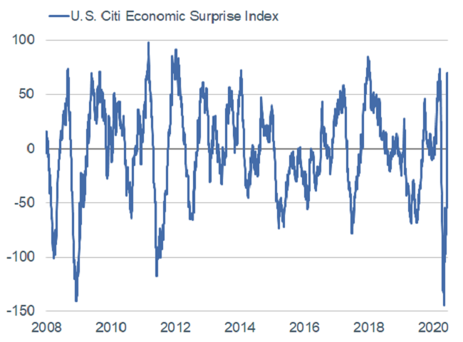

# Schwab Market Perspective Schwab市场前景分析
Mny have been confounded by the stock market's surge since March 23rd amid less-than-rosy U.S. economic data. That disconnect narowed on THursday, as jitters about a potential second wave of COVI-19 infections, along with a grim economic outlook from the Federal Reserve - drove investors out of riskier assets and led to a 5.9% drop in the S&P 500 index.

Ongoing volatility underscores the precariousness of the recent rally. Even as the S&P 500 index rallied to recoup much of hte losses made since its March 23rd low, we have cautioned that a second wave of coronavirus cases could upend invester confidence, raising the prospect of a fresh round of social-distancing restrictions or layoffs.

## U.S. stocks and economy: Mixed signals 美国股市和经济：好坏参半
In recent weeks, the gap between economists' estimates and actual May U.S. payroll gains caused Citi's Economic Surpirse Index to spike. The series, which measures data surprises relative to market expectations, has recovered from its deep plunge into negative territory, confirming that data in the pst wek have continued to come in better than anticipated - although remaining very week in absolute terms.

在最近几个礼拜中， 美国五月份收入数据上升同经济学家的预期之间大差距让花旗银行金融意外指数大跌眼镜（又要甩锅经济学家么）。这个统计相对市场预期实际数据带来的意外指数从3月份的低谷中渐渐恢复，证实了过去一周的数据保持良好的表现，虽然从客观的角度说还是较为弱势（摸棱两可的判断，只挑安全的话讲）。

Source: Charles Schwab, Bloomberg, as of 6/10/2020.

The rub with the recent uptick is that the unexpectedly strong May jobs report - in which payrolls gained 2.5 million jobs and the unemployment rate declined to 13.3% - alone constituted most of the surge into positive territory. In other words, positive surprises reflected extremly low expectations, not a meaningful improvement in the growth rate of the economy. The hole from which the economy has to emerge - however narrow - is deep enough to suggest market-based enthusiasm about a shartp recovery may have been unfounded.

最近上升的问题是，5月就业报告出人意料地强劲，其中就业人数增加250万，失业率下降到13.3%，仅此一项就构成了向积极领域激增的大部分（Fed都出来说报告数据不实了）。换句话说，积极的意外反映了原先极低的预期，而不是经济增长的有意义的改善。经济将要出现的缺口————无论多么狭窄————已经足够表明市场对于快速复苏的热情可能是毫无根据的（听说美股有缺口必补）。

As US stocks rallied off the March lows, measures of investor sentiment followed suit; with some behavioral measures showing signs of excessive optimism and even forth, and attitudinal measures starting to signal complacency.

随着美国股市从3月份的低点反弹，投资者情绪也随之上扬；一些行为指标显示过度乐观甚至鸡犬升天的迹象。

As you can see in the chart below, Ned Davis Research's Crowd Sentiment Pool - a reflection of various sentiment indicators - has merged out of the 'extreme pessimism' zone and, as of June 9th, climbed well into extreme optimism territory. Extremes were also seen in options trading (as per recent findings by SentimenTrader) and huge spikes in hyped-up bankruptcy stocks' prices(as per Bloomberg).

正如下图所示，Ned Davis Research的大众情绪池————反映各种情绪指标的指数————已经从“极端悲观”区合并，在6月9号为止爬升到极端乐观的区域。期权交易中也出现了极端情况（根据SentimenTrader最近的研究成果），破产股票（垃圾股）的价格也大幅飙升（彭博社报道）。

Source: Charles Schwab, ©Copyright 2020 Ned Davis Research, Inc. Further distribution prohibited without prior permission. All Rights Reserved. See NDR Disclaimer at www.ndr.com/copyright.html. For data vendor disclaimers refer to www.ndr.com/vendorinfo/. Data as of 6/10/2020.

We like to remind investors that sentiment at extremes doesn't in and of iteself suggest a near-term surge or pullback is imminent. Rather, it signals that stock have become more vulnerable to negative catalysts, which could come in the form of downbeat economic - or virus-related developments - as was teh case by Thursday.

我们希望提醒投资者，极端情绪并不意味着近期的上涨或回落即将到来。实际上，这表明股市已经变得更容易受到负面催化剂的影响，这些负面催化剂可能以悲观的经济或者与疫情相关的事态发展的形式出现，就像周四的情况一样。

Much of the stock market's recent rally can be attributed to the massive provisions of liquidity and income support from the Federal Reserve and Congress - providing relief measures equal to nearly 30% of the Congressional Budget Office's 2020 estimated U.S. gross doemstic product. Specifically on the monetary front, the Fed's balance sheet has swelled to $7.2 trillion in an effort to ease financial system strains during the crisis.

股市最近的反弹在很大程度上可以归因于美联储和国会提供的大量流动性和收入支持————提供的救助措施相当于国会预算办公室2020年估算的国内生产总值的30%。具体来说，在货币方面为了缓解危机期间金融体系的压力，美联储的资产负债表已经膨胀至7.2万亿美元。

The central bank's large-scale asset purchases have stoked fears of impending inflation, but the risk appears low in the near term. As you can see in the chart below, while money supply has skyrocketed, the velocity of money has moved in the opposite direction. In order to produce inflation, money velocity typically increases as banks lend more; however, banks are currently accumulating assets on their balance sheets and thus keeping money out of circulation.

央行的大规模资产购买引发了人们对通胀迫在眉睫的担忧，但近期风险似乎较低。如下图所示，即使货币供应量猛增，但货币流通四度却朝着相反的方向发展。为了制造通货膨胀，货币流通速度通常随着银行放贷的增加而增加；然而,银行目前正在资产负债表上积累资产，从而阻止货币流通。

Source: Charles Schwab, Bloomberg, Federal Reserve Bank of St. Louis, as of 4/30/2020. M2 is a calculation of the money supply that includes cash and checking deposits, savings deposits, money market securities, mutual funds, and other time deposits. The velocity of money is the number of times one dollar is spent to buy goods and services per unit of time. If the velocity is increasing, then more transactions are occurring between individuals in an economy.

M2是货币供应量的计算，包括现金和支票存款，储蓄存款，货币市场证券，共同基金和其他定期存款。货币流通速度是指每单位时间内一美元用于购买商品和服务的次数。如果流通速度增加，那么在一个经济体中，个体之间就发生更多的交易。

## Global stocks and economy: Improving economy, deteriorating ralationship 全球股市与经济：经济改善，关系恶化